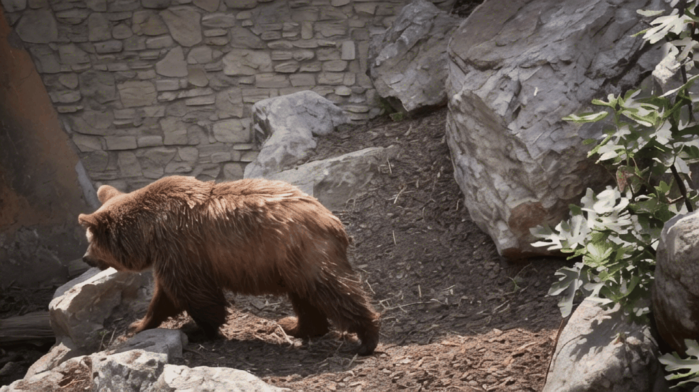

# 🌀 MR-CATR: Motion-Residual Conflict-Aware Time-Reversal Sampler for Generative Inbetweening

This repository provides the official PyTorch implementation of **MR-CATR**, a plug-and-play **inference-time sampler** for **generative video inbetweening**.
MR-CATR builds upon **Stable Video Diffusion (SVD-XT)** and improves time-reversal sampling by explicitly resolving **motion-prior conflicts** between start- and end-conditioned paths.

<p align="center" width="100%">
  
  
  
</p>


## 🚀 Getting Started

### 🔧 1. Environment Setup
Our implementation is based on the official  
[**generative-models**](https://github.com/Stability-AI/generative-models) repository by Stability AI.

Please first clone `generative-models`, and then place `mrcatr.py` into:

```text
generative-models/scripts/sampling/
````

Follow the environment setup instructions provided in the `generative-models` repository.


### 📦 2. Pre-trained Model

Download the **Stable Video Diffusion (SVD-XT)** checkpoint from:

* [https://huggingface.co/stabilityai/stable-video-diffusion-img2vid-xt](https://huggingface.co/stabilityai/stable-video-diffusion-img2vid-xt)

Then specify the local path to the downloaded checkpoint in:

```text
scripts/sampling/configs/svd_xt.yaml
```

For example:

```yaml
ckpt_path: /path/to/svd_xt.safetensors
```


### 🎞️ 3. Video Inbetweening

To run inference with MR-CATR, execute:

```bash
python scripts/sampling/mrcatr.py
```


## Acknowledgements

We gratefully acknowledge the following excellent works:

- [ViBiDSampler: Enhancing Video Interpolation Using Bidirectional Diffusion Sampler](https://vibidsampler.github.io/) ([Code](https://github.com/vibidsampler/vibid))
- [Explorative Inbetweening of Time and Space](https://time-reversal.github.io/) ([Code](https://github.com/HavenFeng/time_reversal))
- [Stable Video Diffusion: Scaling Latent Video Diffusion Models to Large Datasets](https://arxiv.org/abs/2311.15127) ([Code](https://github.com/stability-ai/generative-models))
